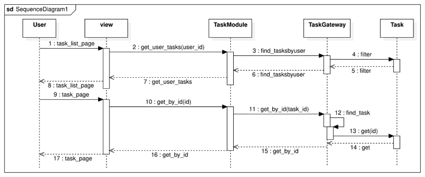

# Домашнее задание №2 по дисциплине "Технологии разработки програмного обеспечения"

Чиварзин Александр ИУ5-12М (2023)

# tests

Тесты не входят в ДЗ №2. Они используются для ЛР №8.

# Вариант ДЗ

* Паттерн бизнес-логики: `row data gateway`
* Паттерн по работе с БД `table module`

# Запуск / особенности

**ВАЖНО:** Код не проверяет пользователя который вошол в систему при создании заданий, ID задания и автора при создании ответа. Эти интендификаторы всегда будут равны 1 :)

1. Запустить сервер Django, проверить, что страница http://localhost:8000 открывается, затем остановить сервер.
2. Выполнить миграции

```
python manage.py migrate
```

3. Создать суперпользователя Django

```shell
python manage.py createsuperuser
```

4. Запустить сервер Django
5. Зайти в админку http://localhost:8000/admin/ с логином и паролем, заданным в п. 3
6. В таблице AppUser добавить запись с любыми данными (в дальнейшем понадобится только имя пользователя)
7. Завершить сеанс админки.
8. На странице http://localhost:8000 указать имя пользователя, созданного в п. 6.

# Диаграмма последовательностей

Получить задание


